# Rendly Multi-Agent AI Backend Architecture

**Document Type:** Engineering Design Document  
**Audience:** Senior Backend Engineers, AI Systems Architects, DevOps Engineers, Infrastructure Reviewers  
**Classification:** Technical Architecture — Multi-Agent AI Automation Workflow System

---

## Table of Contents

1. [Executive Technical Overview](#1-executive-technical-overview)
2. [High-Level System Architecture Diagram](#2-high-level-system-architecture-diagram)
3. [Multi-Agent AI System Architecture](#3-multi-agent-ai-system-architecture)
4. [Serendipity Engine Deep Architecture](#4-serendipity-engine-deep-architecture)
5. [Trending Huddle Intelligence System](#5-trending-huddle-intelligence-system)
6. [Trust & Safety Architecture](#6-trust--safety-architecture)
7. [Spam Report Resolution Workflow](#7-spam-report-resolution-workflow)
8. [Analytics & Growth Intelligence Architecture](#8-analytics--growth-intelligence-architecture)
9. [Performance Marketing Automation System](#9-performance-marketing-automation-system)
10. [DevOps AI Monitoring Layer](#10-devops-ai-monitoring-layer)
11. [Data Layer Architecture](#11-data-layer-architecture)
12. [Event-Driven Automation Layer](#12-event-driven-automation-layer)
13. [Security & Governance](#13-security--governance)
14. [Scaling Strategy](#14-scaling-strategy)
15. [Deployment Blueprint](#15-deployment-blueprint)

---

## 1. Executive Technical Overview

### 1.1 Multi-Agent Backend Summary

Rendly’s backend is a **distributed multi-agent AI automation system** that sits behind a professional social platform with intent-based matching (Serendipity Engine), public/private Huddles, 1:1 Whispers, and video/audio sessions. The AI layer is **event-driven**: domain events from Auth, User, Messaging, Huddle, and Matching services are published to a central message bus; dedicated agent workers consume these events, run ML/LLM pipelines, and write results (embeddings, scores, moderation decisions, insights) back into primary stores, caches, and analytics sinks.

The system is built for **50k → 1M DAU** with a clear path to further scale. Services are designed as **stateless API + stateful workers**: HTTP/WebSocket APIs handle user traffic; background workers run agent pipelines asynchronously to avoid latency coupling and to allow independent scaling of AI workloads.

### 1.2 Event-Driven AI Workflow Orchestration

Orchestration is **event-first**:

- **Event producers:** API services emit domain events (e.g. `user.profile.updated`, `message.sent`, `huddle.joined`, `report.created`) to a message queue (Kafka or RabbitMQ).
- **Event consumers:** Agent workers subscribe to topic/queue patterns, deserialize payloads, and execute pipelines (embedding generation, moderation, trending score, etc.).
- **Idempotency:** Events carry `event_id`; workers deduplicate by `event_id` before processing to support at-least-once delivery.
- **Dead-letter and retries:** Failed processing is retried with exponential backoff; after N failures, events are moved to a DLQ for inspection and manual replay.

This keeps user-facing APIs fast and decouples AI logic from request/response paths.

### 1.3 Microservices vs Modular Monolith Justification

The backend is **microservices-oriented** with bounded contexts:

| Concern | Choice | Rationale |
|--------|--------|-----------|
| Auth, User, Profile | Separate services | Different SLAs, auth tokens vs. profile CRUD; independent scaling and deployment. |
| Messaging (Whispers), Huddle, Matching | Separate services | Distinct domains; matching and huddle ranking are CPU/ML-heavy and scale independently. |
| Moderation, Analytics, Growth, Marketing, DevOps AI | Agent workers + shared APIs | Agent logic is worker-based; “services” here are HTTP APIs for config/reporting plus consumers on the event bus. |

A **modular monolith** is not chosen because: (1) matching and embedding workloads need dedicated CPU/memory and scaling knobs; (2) moderation and analytics have different compliance and retention needs; (3) team parallelism and deployment isolation are required as the org grows.

### 1.4 Scalability Assumptions (50k → 1M Users)

- **50k DAU:** Single-region deployment; PostgreSQL primary + 1 read replica; Redis cluster; one Kafka cluster; agent workers on a small pool (e.g. 4–8 replicas per agent type).
- **500k DAU:** Add read replicas and connection pooling (PgBouncer); shard Redis by entity (e.g. session vs. cache); Kafka partitioning by `user_id`/`huddle_id`; scale agent workers horizontally; consider vector DB (pgvector or dedicated) for matching.
- **1M DAU:** Multi-AZ and optional second region; database read replicas per region; vector DB (e.g. Pinecone/pgvector) scaled for embedding search; dedicated analytics warehouse (e.g. ClickHouse/BigQuery); event bus partitioning and consumer groups tuned for throughput.

---

## 2. High-Level System Architecture Diagram

**Architecture overview:** Clients hit the API Gateway; core services handle requests and persist to the data layer. Services also publish domain events to the Event Bus. AI agent workers consume events and write results back to stores and caches.

```mermaid
flowchart LR
  subgraph Clients["Client Layer"]
    Web["Web App"]
    Mobile["Mobile App"]
  end

  subgraph Gateway["API Gateway"]
    GW["Kong / ALB"]
  end

  subgraph Services["Core Services"]
    Auth["Auth"]
    User["User"]
    Msg["Messaging"]
    Huddle["Huddle"]
    Match["Matching"]
    Mod["Moderation"]
    Analytics["Analytics"]
    Growth["Growth"]
  end

  subgraph Bus["Event Bus"]
    MQ["Kafka / RabbitMQ"]
  end

  subgraph Agents["AI Agent Workers"]
    SA["Serendipity"]
    HT["Huddle Trend"]
    TS["Trust & Safety"]
    SP["Spam Resolution"]
    AG["Analytics & Growth"]
    MA["Marketing"]
    DM["DevOps Monitor"]
  end

  subgraph Data["Data Layer"]
    PG[("PostgreSQL")]
    Vec[("Vector DB")]
    Redis[("Redis")]
    S3[("S3")]
    DWH[("Warehouse")]
  end

  Clients --> Gateway
  Gateway --> Services
  Services --> Data
  Services --> Bus
  Bus --> Agents
  Agents --> Data
```

**Detailed data flow (vertical view):**

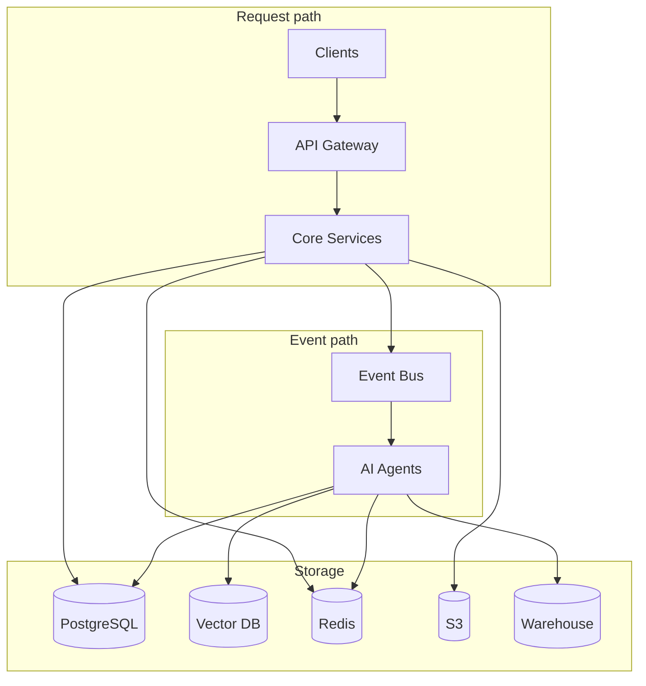

---

## 3. Multi-Agent AI System Architecture

**Multi-Agent System — Event Bus as hub:** Domain events and data sources feed into the Event Bus; each AI agent consumes events and writes outputs to the data layer. The diagram below mirrors the dashboard-plan style: a central orchestration point (Event Bus) with clear data nodes and agent blocks.

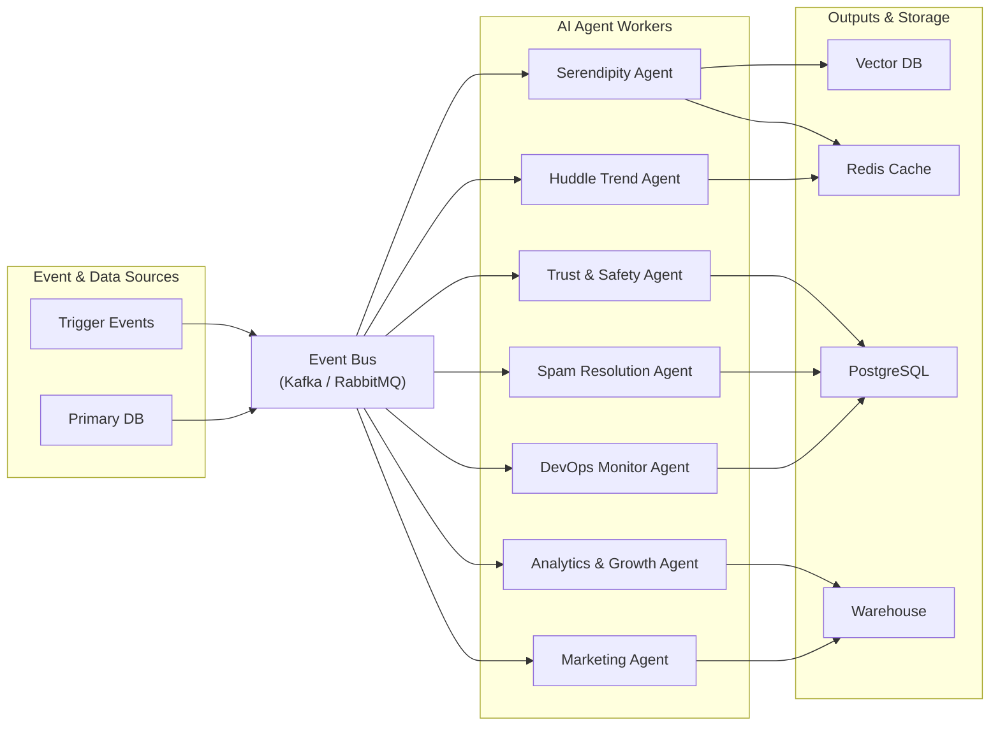

### 3.1 Agent Inventory and Responsibilities

| Agent | Primary responsibility | Trigger model |
|-------|------------------------|---------------|
| Serendipity Agent | Intent embedding and match ranking | Event-driven + on-demand |
| Huddle Trend Intelligence Agent | Trending score and ranking of Huddles | Event-driven + cron |
| Trust & Safety Agent | Real-time content and behavior moderation | Event-driven (sync path for critical content) |
| Spam Resolution Agent | Report triage, summarization, and resolution workflow | Event-driven |
| Analytics & Growth Agent | Cohorts, retention, insights, recommendations | Batch + event-driven |
| Marketing Automation Agent | Funnel analytics, attribution, CAC/ROAS, content suggestions | Batch + event-driven |
| DevOps Monitoring Agent | Metrics, logs, predictive scaling, failure detection | Continuous ingestion |

---

### 3.2 Serendipity Agent

| Attribute | Specification |
|-----------|----------------|
| **Trigger events** | `user.profile.updated`, `user.intents.updated`, `matching.requested` |
| **Input data sources** | User service (profile, intents, geo), connections graph, vector DB (existing embeddings) |
| **Model types** | Embedding model (e.g. sentence-transformers or OpenAI embeddings), optional lightweight ranker |
| **Processing pipeline** | Ingest profile + intents → generate/refresh embedding → upsert vector DB → on match request: vector similarity + geo + graph filters → composite score → ranked list |
| **Output artifacts** | Embedding vectors, match candidate sets, ranking metadata |
| **Storage writes** | Vector DB upsert, Redis cache for hot match lists (TTL) |
| **Escalation** | None; fallback to random/popular if vector search fails |
| **Observability** | Latency histograms (embedding, search, rank), cache hit rate, event lag |

---

### 3.3 Huddle Trend Intelligence Agent

| Attribute | Specification |
|-----------|----------------|
| **Trigger events** | `huddle.created`, `huddle.join`, `huddle.leave`, `huddle.visit`, cron `huddle.trending.refresh` |
| **Input data sources** | Huddle service (metadata, participants), analytics events (visit_velocity, seat_velocity), topic embeddings |
| **Model types** | Topic embedding model, time-decay formula, optional clustering (e.g. K-means on topic vectors) |
| **Processing pipeline** | Compute visit/seat velocity, apply recency decay, optional topic clustering → trending score → sort and store |
| **Output artifacts** | Trending score per huddle, ranked list, topic clusters |
| **Storage writes** | Redis sorted set (trending list), PostgreSQL materialized view or table for admin |
| **Escalation** | None |
| **Observability** | Score distribution, refresh latency, queue depth |

---

### 3.4 Trust & Safety Agent

| Attribute | Specification |
|-----------|----------------|
| **Trigger events** | `message.sent`, `message.edited`, `huddle.message`, `user.reported`, `content.uploaded` |
| **Input data sources** | Message/comment body, media URLs, user history (frequency, patterns), report context |
| **Model types** | LLM moderation API (e.g. OpenAI Moderation or custom), pattern/rule engine, URL/heuristic filters, anomaly detection (rate, volume) |
| **Processing pipeline** | Layer 1: LLM moderation → Layer 2: pattern/URL/spam rules → Layer 3: behavioral anomaly + report clustering → risk score → action (allow/warn/restrict/block) |
| **Output artifacts** | Risk score, action recommendation, moderation labels, audit record |
| **Storage writes** | Moderation DB (decisions, audit log), user restrictions table, Redis blocklist/cache |
| **Escalation** | High risk or contested → human review queue; configurable thresholds |
| **Observability** | Latency per layer, block rate, escalation rate, model drift metrics |

---

### 3.5 Spam Resolution Agent

| Attribute | Specification |
|-----------|----------------|
| **Trigger events** | `report.created`, `report.updated`, `moderation.review.requested` |
| **Input data sources** | Reports (reporter, reported entity, reason, content snapshot), user/moderation history |
| **Model types** | LLM for summarization and priority scoring, rule-based decision tree |
| **Processing pipeline** | Ingest report → priority score → AI summarization → decision tree (auto-dismiss, auto-action, or escalate) → apply action and log |
| **Output artifacts** | Report summary, priority score, recommended action, audit trail |
| **Storage writes** | Report state machine table, audit log, user restrictions if action taken |
| **Escalation** | Escalate to human queue when confidence below threshold or policy requires review |
| **Observability** | Resolution time, auto vs. human ratio, queue depth |

---

### 3.6 Analytics & Growth Agent

| Attribute | Specification |
|-----------|----------------|
| **Trigger events** | `user.signed_up`, `user.retention_snapshot`, `engagement.*`, cron `analytics.daily` |
| **Input data sources** | Event stream, data warehouse (cohorts, retention, DAU/WAU/MAU, graph metrics) |
| **Model types** | Aggregation and cohort SQL, optional LLM for insight generation, anomaly detection (e.g. engagement drop) |
| **Processing pipeline** | Ingest events → ETL to warehouse → cohort/retention/graph metrics → anomaly detection → AI insight narrative → growth recommendations |
| **Output artifacts** | Dashboards, retention curves, cohort tables, insight text, recommendation payloads |
| **Storage writes** | Warehouse tables, Redis for cached metrics and recommendations |
| **Escalation** | Critical anomaly → alert to Slack/PagerDuty |
| **Observability** | Pipeline latency, warehouse freshness, insight generation success rate |

---

### 3.7 Marketing Automation Agent

| Attribute | Specification |
|-----------|----------------|
| **Trigger events** | `campaign.ingested`, `funnel.step`, cron `marketing.attribution.run` |
| **Input data sources** | Campaign and funnel events, attribution model outputs, CAC/ROAS aggregates |
| **Model types** | Attribution model (e.g. last-touch or multi-touch), regression for CAC, optional LLM for copy suggestions |
| **Processing pipeline** | Ingest campaign/funnel data → attribution → CAC/ROAS computation → optimization loop (budget reallocation, audience segments) → content pipeline suggestions |
| **Output artifacts** | Attribution reports, CAC/ROAS metrics, budget reallocation suggestions, audience and content recommendations |
| **Storage writes** | Marketing DB / warehouse, Redis for latest suggestions |
| **Escalation** | Budget or ROAS anomaly → alert |
| **Observability** | Attribution run latency, suggestion acceptance rate |

---

### 3.8 DevOps Monitoring Agent

| Attribute | Specification |
|-----------|----------------|
| **Trigger events** | Continuous: metrics (Prometheus), logs (aggregated), traces; alerts on thresholds |
| **Input data sources** | Prometheus/Grafana, log aggregation (e.g. CloudWatch, ELK), route latency, WebSocket health checks |
| **Model types** | Threshold rules, simple anomaly detection (e.g. moving average + sigma), optional ML for predictive scaling |
| **Processing pipeline** | Ingest metrics/logs → normalize → threshold and anomaly detection → predictive scaling signals → alert and auto-scale triggers |
| **Output artifacts** | Alerts, scaling recommendations, incident summaries |
| **Storage writes** | Time-series DB or logging store, incident table |
| **Escalation** | Critical alerts → PagerDuty/Slack; auto-scale triggers to orchestrator |
| **Observability** | Alert latency, false positive rate, scaling action log |

---

## 4. Serendipity Engine Deep Architecture

### 4.1 Intent Embedding Generation

- **Source:** User profile fields (bio, profession, declared intents) concatenated into a single text representation.
- **Model:** Sentence embedding model (e.g. `all-MiniLM-L6-v2` or OpenAI `text-embedding-3-small`) to produce a fixed-size vector (e.g. 384 or 1536 dimensions).
- **Refresh:** On `user.profile.updated` or `user.intents.updated`; batch re-embedding job for backfill or model change.
- **Storage:** Vector DB: one vector per user (or per intent slice if multi-vector per user). Metadata: `user_id`, `updated_at`, optional `intent_labels`.

### 4.2 Vector Similarity Search

- **Index:** pgvector (PostgreSQL extension) or Pinecone. Index type: HNSW or IVFFlat for approximate nearest neighbor (ANN).
- **Query:** Embed the requesting user’s profile; run ANN search with filters (e.g. exclude blocked, exclude already connected, optional geo radius).
- **Result:** Top-K candidate IDs (e.g. K = 200) passed to the ranking stage.

### 4.3 Geo-Spatial Scoring

- **Input:** User’s last-known lat/lon or region (e.g. country/state).
- **Score:** Distance-based decay, e.g.  
  \( s_{\text{geo}}(u, v) = \exp(-\lambda \cdot d(u,v)) \)  
  where \( d \) is Haversine distance (or region-level distance) and \( \lambda \) is a tuning constant. Optional time-zone affinity bonus.

### 4.4 Mutual Network Graph Scoring

- **Input:** Graph of connections (who is connected to whom).
- **Score:** Common-neighbor or Jaccard-style affinity:  
  \( s_{\text{graph}}(u, v) = \frac{|\Gamma(u) \cap \Gamma(v)|}{|\Gamma(u) \cup \Gamma(v)| + \epsilon} \)  
  or a weighted variant using connection strength. Used to boost “friend-of-friend” style matches.

### 4.5 Weighted Composite Scoring and Ranking

- **Formula:**  
  \( \text{score}(u, v) = w_1 \cdot s_{\text{vec}}(u,v) + w_2 \cdot s_{\text{geo}}(u,v) + w_3 \cdot s_{\text{graph}}(u,v) \)  
  with \( w_1 + w_2 + w_3 = 1 \). Weights are configurable (e.g. 0.6, 0.2, 0.2).
- **Ranking service:** Sorts candidates by `score`, applies business rules (e.g. diversity, cap per session), returns ordered list to API.

### 4.6 Data Schema (Conceptual)

```sql
-- User intent embedding (vector DB or PG with pgvector)
CREATE TABLE user_intent_embeddings (
  user_id UUID PRIMARY KEY,
  embedding vector(384),  -- or 1536
  intent_labels text[],
  updated_at timestamptz
);

-- Match cache (Redis or PG) for hot paths
-- Key: match:{user_id}:{intent_hash} -> sorted set of (candidate_id, score)
```

### 4.7 Recalculation and Cache Invalidation

- **Recalculation:** Embedding refresh on profile/intent events; full re-rank on each match request using latest vectors and graph (or periodic re-rank job that writes to cache).
- **Cache invalidation:** TTL on Redis match list (e.g. 5–15 min); invalidate on `user.profile.updated` for that user and optionally for users who had this user in their candidate set (lazy invalidation on next request is acceptable).

### 4.8 Serendipity Pipeline Diagram

**Flow:** User profile and intents are embedded, stored in the vector DB, then the ranking engine (vector similarity + geo + graph) produces the final match list.

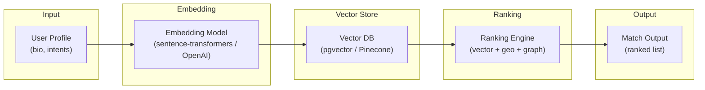

---

## 5. Trending Huddle Intelligence System

### 5.1 Visit Velocity

- **Definition:** Count of unique visitors (or visits) to a Huddle in a sliding time window (e.g. last 1 hour).
- **Metric:** \( v_{\text{visit}}(h, t) = |\{\text{visit events for } h \text{ in } [t-W, t]\}| \) with \( W = 1\text{h} \) (configurable).

### 5.2 Seat Booking Velocity

- **Definition:** Rate of joins (seat bookings) in a sliding window.
- **Metric:** \( v_{\text{seat}}(h, t) = \text{count of join events in } [t-W, t] \).

### 5.3 Topic Embedding Clustering

- **Input:** Huddle title and description (and optional tags) concatenated and embedded.
- **Use:** Cluster Huddles by topic for “similar trending” or diversity in trending list; optional boost for clusters with high aggregate velocity.

### 5.4 Recency Decay Function

- **Model:** Exponential time decay so that older Huddles (by start or last activity) rank lower.  
  \( d(t) = \exp(-\mu \cdot (t_{\text{now}} - t_{\text{activity}})) \)  
  where \( \mu \) is decay rate (e.g. per hour).

### 5.5 Trending Score Formula

- **Composite:**  
  \( \text{trending}(h) = \alpha \cdot v_{\text{visit}}(h) + \beta \cdot v_{\text{seat}}(h) + \gamma \cdot d(t) + \delta \cdot \text{recency}(h) \)  
  with tunable \( \alpha, \beta, \gamma, \delta \). Normalize velocities (e.g. by max in cohort) before weighting.
- **Output:** Sorted list of Huddle IDs by descending `trending(h)`.

### 5.6 Real-Time Recalculation and Worker Queue

- **Events:** Each `huddle.visit` and `huddle.join`/`leave` is published to the event bus.
- **Worker:** Consumes these events; updates per-Huddle aggregates (e.g. in Redis or a small DB table); recomputes trending score and updates a Redis sorted set (key e.g. `trending:huddles`, score = trending value).
- **Cron:** Optional full refresh job (e.g. every 5 min) to recompute all Huddles from source of truth and repopulate the sorted set.

### 5.7 Ranking Refresh and Horizontal Scaling

- **Refresh:** Event-driven incremental update + periodic full refresh.
- **Scaling:** Partition events by `huddle_id` so that multiple worker instances can process different Huddles in parallel; single writer to the sorted set (or shard by range of `huddle_id`) to avoid write contention.

### 5.8 Trending Huddle Pipeline Diagram

**Flow:** Huddle events (visit, join/leave) are consumed by the worker; velocity and recency decay are computed; trending score is written to a Redis sorted set for low-latency reads.

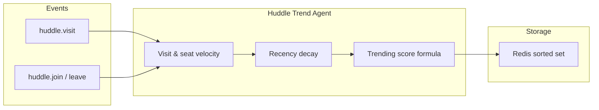

---

## 6. Trust & Safety Architecture

### 6.1 Multi-Layer Moderation Pipeline

**Layer 1 — Real-time LLM moderation**

- **Input:** Message/comment text (and optionally media description).
- **API:** Call to LLM moderation service (e.g. OpenAI Moderation API or custom model) for categories (hate, violence, sexual, self-harm, etc.).
- **Output:** Category flags and a single block/allow recommendation. High-severity → immediate block and audit.

**Layer 2 — Pattern and anomaly**

- **Pattern-based spam:** Regex and keyword lists for known spam/phishing; configurable block/warn.
- **URL frequency:** Count of URLs per user per time window; threshold breach → flag or restrict.
- **Anomaly:** Message rate or volume above N sigma from user baseline → flag for Layer 3 or auto-restrict.

**Layer 3 — Behavioral and report-based**

- **Behavioral anomaly:** Sequence of actions (e.g. mass add, mass message) and velocity; model or rules → risk score.
- **Report clustering:** Cluster reports by reported entity; high report count or similar report reasons → boost priority and risk score.

### 6.2 Risk Scoring Algorithm

- **Combination:**  
  \( r = \min(1, w_1 \cdot \text{llm\_score} + w_2 \cdot \text{pattern\_score} + w_3 \cdot \text{anomaly\_score} + w_4 \cdot \text{report\_score}) \)  
  with weights and per-layer normalization (e.g. 0–1 scales).
- **Action mapping:** \( r \in [0, t_1) \) allow; \( [t_1, t_2) \) warn and log; \( [t_2, t_3) \) restrict (e.g. no messaging); \( \ge t_3 \) block and escalate.

### 6.3 Automated Restriction Workflow

- On risk above threshold: write to `user_restrictions` (e.g. `no_whisper`, `no_huddle_create`, `shadow_ban`); invalidate session/cache so UI reflects restriction; optionally notify user and add to human review queue.

### 6.4 Human-in-the-Loop Escalation

- **Escalation triggers:** Risk in upper band, user appeal, or N reports against same entity. Create ticket in review queue with context (content, risk score, user history).
- **Review UI:** Moderator can confirm/override action, add notes, and close; outcome written back to moderation DB and user_restrictions.

### 6.5 Trust & Safety Flow Diagram

**Flow:** Content passes through three layers (LLM → pattern/URL rules → behavioral/report clustering); combined risk score drives action (allow / warn / restrict / block); restrict and block can escalate to human review.

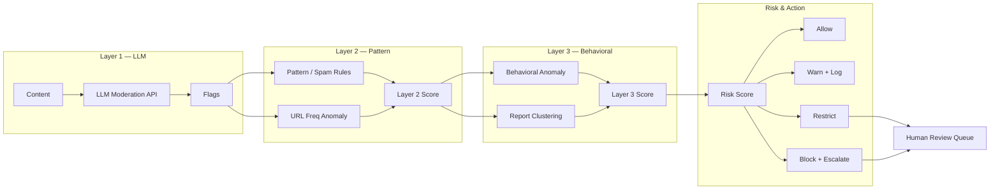

---

## 7. Spam Report Resolution Workflow

### 7.1 Report Ingestion Pipeline

- **Event:** `report.created` (reporter_id, reported_entity_type, reported_entity_id, reason, content_snapshot, metadata).
- **Ingestion:** API writes to `reports` table with status `pending`; event published to bus for Spam Resolution Agent.

### 7.2 Priority Scoring

- **Factors:** Reporter reputation, report reason category, recency, count of reports against same entity, entity type (user vs. message vs. huddle).
- **Formula:** Linear or weighted sum normalized to 0–1; higher = higher priority in queue.

### 7.3 AI Summarization

- **Input:** All report fields and optional content body (truncated).
- **Model:** LLM call to produce short summary and suggested category (spam, abuse, off-topic, etc.).
- **Output:** Stored on report record for moderator or decision tree.

### 7.4 Decision Tree Logic

- **Branches:**  
  - If priority low and category = “clear false positive” → auto-dismiss.  
  - If category = “known spam pattern” and confidence high → auto-action (e.g. restrict entity).  
  - Else → enqueue for human review.  
- **Auto-action:** Update report status to `resolved`, apply user/huddle restriction if applicable, write audit log.

### 7.5 Audit Trail Logging

- **Logged:** report_id, state transitions, actor (system vs. user_id), action taken, timestamp. Immutable append-only log for compliance.

### 7.6 State Transition Diagram

**Report lifecycle:** Reports start as `pending`; the agent summarizes and prioritizes; then the decision tree routes to auto-dismiss, auto-action, or human queue; human review can resolve or escalate.

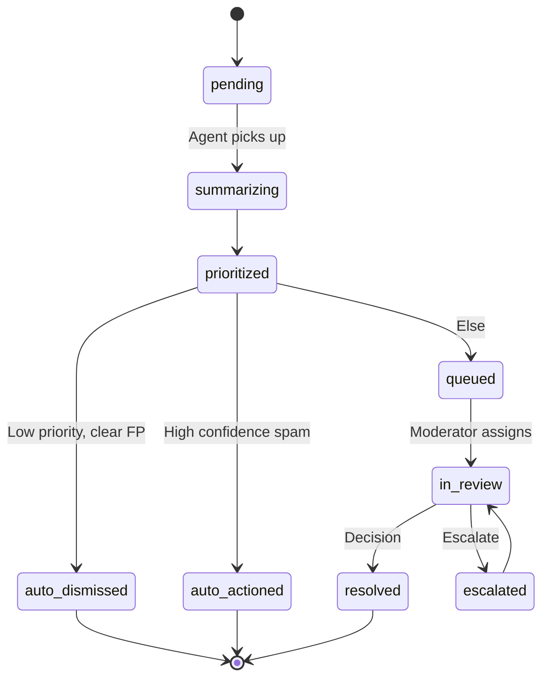

**Spam resolution pipeline (flowchart):**

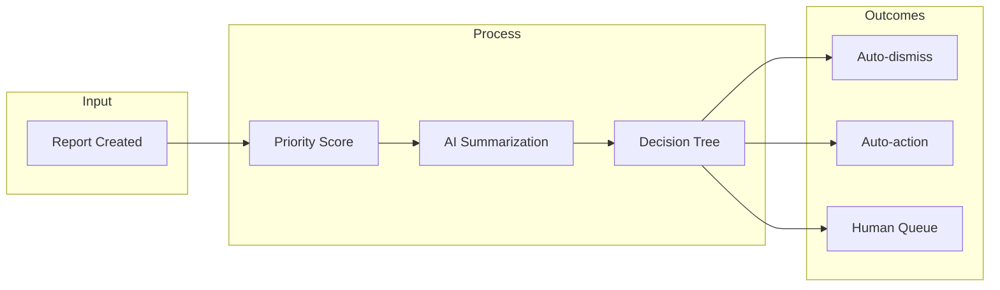

---

## 8. Analytics & Growth Intelligence Architecture

### 8.1 Event Tracking System

- **Events:** Emitted from backend (and optionally frontend) with schema: `event_name`, `user_id`, `timestamp`, `properties` (JSON). Examples: `sign_up`, `session_start`, `huddle_join`, `whisper_sent`, `match_request`.
- **Transport:** Sync (API) or async (queue) to an ingestion endpoint; batch insert into warehouse or stream (Kafka) for real-time pipelines.

### 8.2 Data Warehouse

- **Store:** Dedicated analytics DB (e.g. ClickHouse, BigQuery, or Snowflake) or PostgreSQL schema with partitioning by date.
- **Tables:** `events` (raw or aggregated), `users_daily` (DAU snapshot), `cohorts`, `retention_*`, `graph_metrics`.

### 8.3 Cohort Analysis and Retention Curves

- **Cohort:** Group users by signup week (or month). For each cohort, compute retention as % still active at D1, D7, D30 (and optionally W1, W4).
- **Retention curve:** Retention % vs. time since signup; stored as materialized table or view for dashboards.

### 8.4 DAU/WAU/MAU Metrics

- **DAU:** Count distinct user_id with at least one activity event in the day.
- **WAU/MAU:** Same over 7-day and 30-day windows. Stored daily for trend charts.

### 8.5 Graph Density Calculations

- **Metrics:** Edges (connections) per user; density = 2*edges / (n*(n-1)); component size distribution. Computed periodically and stored for growth agent.

### 8.6 AI Insight Generation and Growth Recommendations

- **Input:** Precomputed metrics (retention, DAU, cohorts, graph density, feature adoption).
- **Model:** LLM or template + rules to generate short insight narratives (e.g. “D7 retention dropped 5% for cohort X”) and recommendations (e.g. “Increase onboarding email for segment Y”).
- **Output:** Stored in DB or cache for admin dashboard and optional notifications.

### 8.7 Feature Adoption and Engagement Anomaly Detection

- **Feature adoption:** % of DAU that used feature F in last 7 days; trend over time.
- **Anomaly:** Baseline (e.g. 7-day rolling mean) vs. current; alert if drop exceeds N sigma or threshold %.

---

## 9. Performance Marketing Automation System

### 9.1 Campaign Data Ingestion

- **Sources:** Ad platform APIs (Meta, Google, etc.) or CSV upload: spend, impressions, clicks, conversions by campaign/ad set/creative and date.
- **Pipeline:** ETL into marketing schema (campaign_id, date, spend, impressions, clicks, conversions, attribution_conversions).

### 9.2 Funnel Analytics

- **Stages:** Signup → onboarding_complete → first_match → first_huddle → paid (if applicable). Funnel event stream aggregated by stage and date.
- **Output:** Funnel step counts and conversion rates between stages for each campaign or channel.

### 9.3 Attribution Modeling

- **Model:** Last-touch or multi-touch (linear, time-decay) assigning credit to touchpoints before conversion.
- **Output:** Attribution table: conversion_id, attributed_campaign_id, attributed_channel, credit_weight.

### 9.4 CAC and ROAS

- **CAC:** Spend per attributed signup (or per attributed conversion) by campaign/channel.  
  \( \text{CAC} = \frac{\text{Spend}}{\text{Attributed conversions}} \)
- **ROAS:** Revenue (if any) / Spend by campaign.  
  \( \text{ROAS} = \frac{\text{Attributed revenue}}{\text{Spend}} \)

### 9.5 ROAS Optimization Loop

- **Input:** Current CAC/ROAS by campaign and segment.
- **Logic:** Compare to target; suggest budget increase for outperforming campaigns and decrease for underperformers; output budget reallocation table (campaign_id, suggested_daily_budget).

### 9.6 Content Generation Pipeline

- **Input:** Campaign goal, audience segment, past creative performance.
- **Model:** LLM or A/B copy generator suggesting headlines, body copy, or creative angles.
- **Output:** Suggestions stored for human approval and push to ad platforms via API or manual.

### 9.7 AI Suggestions Summary

- **Budget reallocation:** From ROAS/CAC comparison and targets.
- **Audience targeting:** Segment performance → suggest lookalike or interest expansion.
- **Content strategy:** Top-performing creative attributes → suggest new variants.

---

## 10. DevOps AI Monitoring Layer

### 10.1 Metrics Ingestion

- **Stack:** Prometheus for scraping service metrics (request rate, latency, errors); Grafana for dashboards. Optionally Datadog or CloudWatch.
- **Metrics:** HTTP request duration (p50, p95, p99), error rate, queue depth, CPU/memory per service.

### 10.2 Log Aggregation

- **Stack:** Centralized logging (e.g. ELK, Loki, or CloudWatch Logs). Services emit structured JSON logs with correlation_id.
- **Use:** Search, alerting on error patterns, and feeding DevOps agent for anomaly detection.

### 10.3 Route Latency Tracking

- **Implementation:** Middleware or API gateway records route + method + status + duration; export to Prometheus histogram. Per-route dashboards and SLOs.

### 10.4 WebSocket Health Monitoring

- **Metrics:** Active connections count, connect/disconnect rate, message rate, ping RTT. Alerts on sudden drop or latency spike.

### 10.5 Predictive Scaling Alerts

- **Logic:** Trend of request rate or CPU; if projected to exceed threshold in next N minutes, emit “scale up” recommendation. Optional integration with orchestrator (e.g. Kubernetes HPA or custom Lambda).

### 10.6 Error Spike Detection

- **Logic:** Baseline error rate (e.g. 5-min rolling); if current rate > baseline + k*sigma, trigger alert and optional runbook.

### 10.7 Load Testing Architecture

- **Tools:** k6, Locust, or Artillery; scripts against staging or dedicated load environment. Scenarios: auth, match request, huddle join, message send.
- **Integration:** Run in CI or scheduled; store results (RPS, latency, error rate) for trend and regression.

### 10.8 Auto-Scaling Trigger Logic

- **Triggers:** CPU > 70%, request latency p99 > SLO, queue depth > N. Scale-out step: add N replicas; scale-in with cooldown to avoid flapping.

### 10.9 Failure Isolation Model

- **Circuit breaker:** Per downstream (DB, Redis, external API); open after N failures; half-open for probe. Prevents cascade.
- **Bulkheads:** Limit concurrency per tenant or route so one noisy tenant does not starve others.

---

## 11. Data Layer Architecture

### 11.1 PostgreSQL Schema Separation

- **Schemas:** `auth`, `users`, `messaging`, `huddles`, `matching`, `moderation`, `analytics` (or separate DBs per bounded context). Enables access control and logical isolation.
- **Usage:** Core CRUD and transactional consistency; read replicas for reporting and analytics reads.

### 11.2 Vector DB Integration

- **Option A:** pgvector in PostgreSQL for simplicity and single-store ops.
- **Option B:** Dedicated (e.g. Pinecone) for very large scale and low-latency ANN. Sync: embedding service writes to both primary (metadata) and vector DB (vectors); match API reads from vector DB and optionally cache in Redis.

### 11.3 Redis Caching Layer

- **Use cases:** Session store, match list cache, trending sorted set, rate-limit counters, moderation blocklist cache.
- **Pattern:** Cache-aside; TTL per key type; invalidation on write where required.

### 11.4 Object Storage for Media

- **Store:** S3 or compatible (e.g. MinIO). Buckets: avatars, huddle media, message attachments. Presigned URLs for upload/download; CDN in front for reads.

### 11.5 Analytics Warehouse

- **Store:** Dedicated warehouse (ClickHouse, BigQuery, or Redshift) for events and aggregated tables. ETL from primary DB and event stream; batch and/or streaming.

### 11.6 Data Layer Diagram

**Flow:** API services and agent workers read/write the primary store, vector store, cache, object store, and analytics warehouse. Cache is populated from PostgreSQL and vector DB for hot paths.

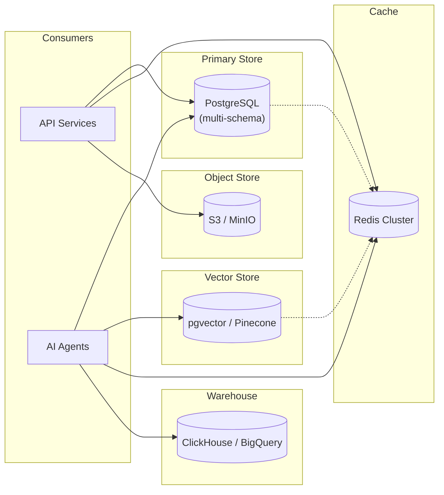

---

## 12. Event-Driven Automation Layer

### 12.1 Message Queue (Kafka / RabbitMQ)

- **Kafka:** Topics per domain (e.g. `user.events`, `messaging.events`, `huddle.events`, `moderation.events`). Partitioning by key (e.g. user_id) for ordering. Consumer groups per agent type.
- **RabbitMQ:** Exchanges and queues per agent; dead-letter exchange for failed messages.

### 12.2 Event-Driven Triggers

- **Publishers:** Services publish after DB commit (outbox pattern or direct publish). Event payload: event_id, event_type, timestamp, payload (JSON).
- **Subscribers:** Agent workers subscribe to topic(s); filter by event_type if needed; process and ack.

### 12.3 Async Workers

- **Runtime:** Containerized workers (Node, Go, or Python) that pull from queue or Kafka consumer; scale by replica count. Stateless; state in DB/Redis.

### 12.4 AI Pipeline Orchestration

- **Orchestration:** Per-agent pipeline implemented as sequential steps (fetch input → call model → write output). For multi-step agents (e.g. moderation layers), steps run in process or via internal queue. No global orchestrator required; each agent is self-contained.

### 12.5 Retry and Failure Handling

- **Retry:** Exponential backoff (e.g. 1s, 2s, 4s) up to N times; then DLQ.
- **DLQ:** Failed messages moved to DLQ; monitoring and manual replay or fix-and-replay.
- **Idempotency:** Event_id stored in processed set (Redis or DB); skip if already processed.

### 12.6 Message Flow Diagram

**Flow:** Core services publish domain events to the Event Bus; agent workers consume by topic/queue and process asynchronously.

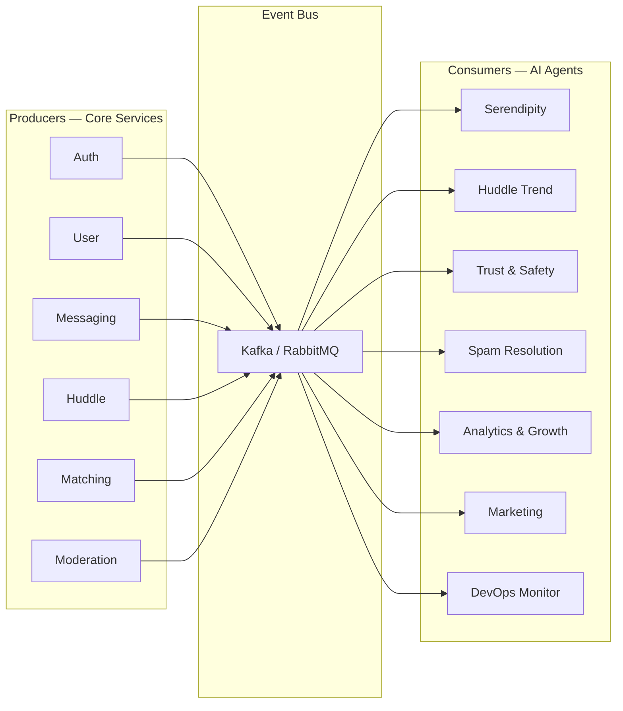

---

## 13. Security & Governance

### 13.1 Data Privacy

- **PII:** Stored encrypted at rest (DB and object store); minimal PII in events (prefer id only); retention policies and purge for GDPR.
- **Access:** Role-based access; services use service accounts with least privilege; no PII in logs in production.

### 13.2 Moderation Audit Logs

- **Scope:** All moderation decisions (allow/block/restrict), report state changes, and human review actions. Immutable, append-only; retention per policy (e.g. 2 years).

### 13.3 AI Bias Monitoring

- **Metrics:** Moderation and match outcomes by segment (e.g. region, signup cohort); track disparity in block rate or match rate. Alerts on drift; periodic review for fairness.

### 13.4 Access Control

- **APIs:** JWT validation at gateway; scope/permission checks in services. Admin and agent endpoints use separate credentials and network isolation where possible.
- **Data:** Row-level or schema-level access where supported; analytics warehouse access restricted to analytics and growth services.

### 13.5 Rate Limiting

- **Layer:** API gateway or service middleware. Limits per user_id and per IP (e.g. requests/min). Stricter limits for auth and match endpoints to prevent abuse.

### 13.6 Abuse Prevention

- **Measures:** Rate limits, circuit breakers, CAPTCHA or challenge for suspicious signup/session; moderation pipeline and blocklist; optional device fingerprinting for repeat abusers.

---

## 14. Scaling Strategy

### 14.1 Horizontal Scaling Model

- **APIs:** Stateless; scale by adding replicas behind load balancer. Session state in Redis.
- **Workers:** Scale consumer replicas; Kafka partition count limits parallelism per topic (scale partitions as needed).
- **DB:** Read replicas for read-heavy paths; connection pooling (PgBouncer).

### 14.2 Stateless API Design

- **No local session:** Auth tokens or session IDs; session data in Redis. Enables any replica to serve any request.

### 14.3 Database Sharding Considerations

- **When:** When single primary write capacity or storage becomes bottleneck (e.g. beyond ~1M DAU with heavy write).
- **Strategy:** Shard by user_id (e.g. user_id % N); matching and messaging routes to shard by user. Cross-shard queries avoided or done via aggregator.

### 14.4 Edge Caching Strategy

- **Static assets:** CDN (CloudFront/Cloudflare) with long TTL.
- **API:** Cache read-heavy, user-scoped or global data (e.g. trending list) at gateway or Redis with short TTL. Invalidate on write where necessary.

### 14.5 Global Deployment Readiness

- **Multi-region:** Primary in one region; read replicas or secondary DB in second region for DR and low-latency reads. Event bus replication or multi-region Kafka for critical topics.
- **Data residency:** Option to pin user data to region (e.g. EU) for compliance; routing and replication configured accordingly.

---

## 15. Deployment Blueprint

### 15.1 Recommended AWS Stack

| Component | AWS Service |
|-----------|-------------|
| Compute | ECS Fargate or EKS (Kubernetes) |
| API entry | ALB + API Gateway (optional) |
| Database | RDS PostgreSQL (Multi-AZ); or Aurora |
| Cache | ElastiCache Redis |
| Object storage | S3 |
| Message queue | MSK (Kafka) or Amazon MQ (RabbitMQ) |
| Vector search | pgvector on RDS or Pinecone (SaaS) |
| Warehouse | Redshift or external (BigQuery/Snowflake) |
| Secrets | Secrets Manager |
| CDN | CloudFront |

### 15.2 Container Orchestration (ECS/Kubernetes)

- **Containers:** One image per service and per agent type. Images in ECR.
- **ECS:** Services as Fargate tasks; ALB target groups; auto-scaling by CPU or request count.
- **Kubernetes:** Deployments per service; HPA; Ingress (or ALB Ingress Controller). Separate namespaces for apps vs. agents vs. observability.

### 15.3 CI/CD Flow

- **Pipeline:** Git push → build (e.g. CodeBuild or GitHub Actions) → run tests → build Docker image → push to ECR → deploy to staging (e.g. ECS service update or k8s rollout) → smoke tests → manual or auto promote to prod.
- **Agents:** Same pipeline; deploy as separate services/consumers with independent versioning.

### 15.4 Observability Stack

- **Metrics:** Prometheus + Grafana (or CloudWatch Container Insights).
- **Logs:** CloudWatch Logs or Fluent Bit → OpenSearch/Elasticsearch.
- **Traces:** X-Ray or Jaeger; trace_id in logs and metrics for correlation.
- **Alerts:** Prometheus Alertmanager or CloudWatch Alarms → SNS → PagerDuty/Slack.

### 15.5 Final Infrastructure Diagram

**Flow:** Users reach the edge (CloudFront); compute (ECS/EKS) serves APIs and runs agent workers; data layer and event bus (MSK) sit in the same cloud; observability ingests from compute.

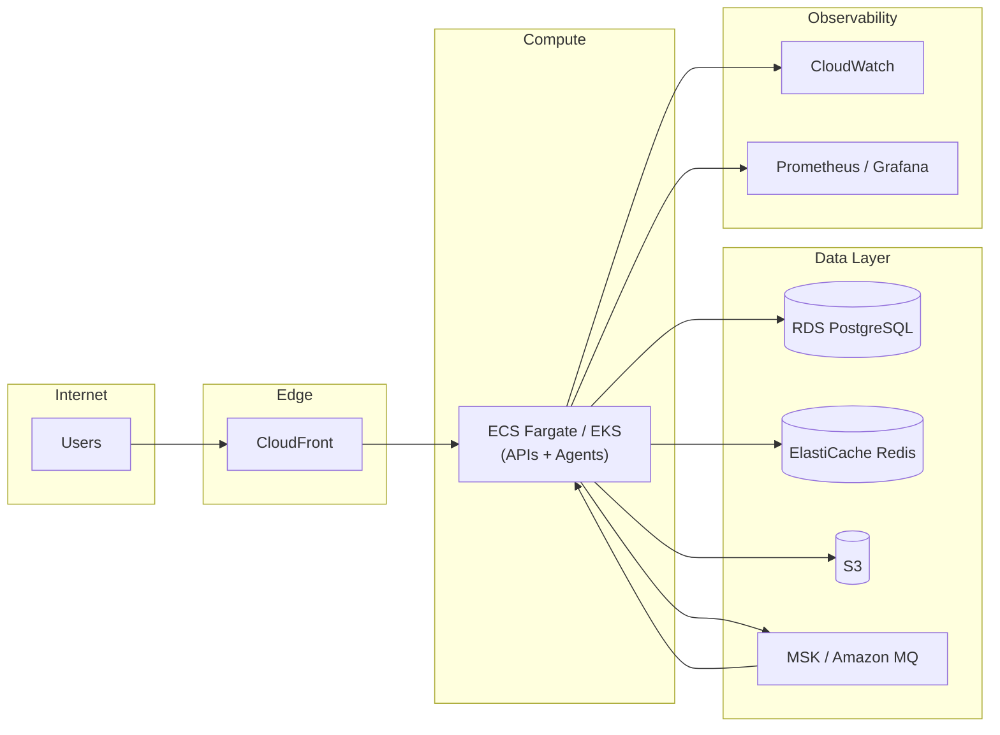

---

*End of document. For implementation details, refer to service-specific ADRs and runbooks.*
